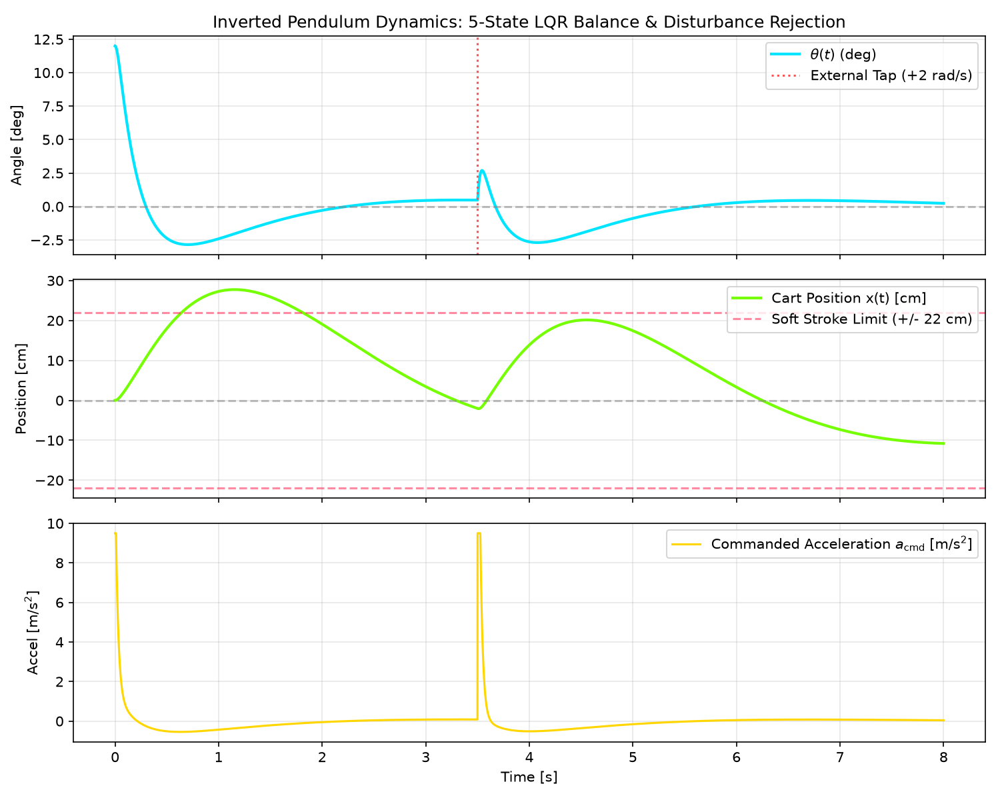

# Inverted Pendulum Mechatronic Testbed (Linear Rail MGN12)

[](LICENSE)
[](https://www.python.org/)
[](https://platformio.org/)
[]()

Physical mechatronic testbed and control architecture for experimental research and validation of **nonlinear control (Åström-Furuta Lyapunov Energy Swing-Up)**, **asymptotic optimal control (5-State CARE LQR with anti-drift integral action)**, and **nonlinear state estimation (3-State EKF at 200 Hz)** on a motorized MGN12 linear rail.

---

## System Identification & Physical Constants

| Parameter | Symbol | Identified Value | Units | Description |
| :--- | :---: | :---: | :---: | :--- |
| **Cart Mass** | $M$ | $0.380$ | $\text{kg}$ | Carriage platform + MGN12H block + encoder mount |
| **Pendulum Mass** | $m$ | $0.020$ | $\text{kg}$ | Carbon fiber tube ($7\text{g}$) + tip mass ($10\text{g}$) + hub ($3\text{g}$) |
| **Total Rod Length** | $L$ | $0.200$ | $\text{m}$ | $200\text{ mm}$ pultruded carbon fiber tube |
| **Center of Mass (COM)** | $l$ | $0.135$ | $\text{m}$ | $l = \frac{m_r (L/2) + m_{\text{tip}} L}{m} = 0.135\text{ m}$ |
| **Moment of Inertia (Pivot)** | $J$ | $4.933 \times 10^{-4}$ | $\text{kg}\cdot\text{m}^2$ | $J = \frac{1}{3} m_r L^2 + m_{\text{tip}} L^2$ |
| **Natural Frequency** | $\omega_0$ | $7.328$ | $\text{rad/s}$ | $\omega_0 = \sqrt{\frac{m g l}{J}} \implies T_0 \approx 0.857\text{ s}$ |
| **Input Coupling** | $\alpha$ | $5.473$ | $\text{rad}/(\text{m}\cdot\text{s}^2)$ | Acceleration coupling: $\alpha = \frac{m l}{J}$ |
| **Target Swing-Up Energy** | $E_0$ | $0.0530$ | $\text{J}$ | $E_0 = 2 m g l$ |
| **Actuator & Driver** | -- | NEMA 17 + TMC2209 | -- | $24\text{V DC}$ Mean Well, $1/16$ microstepping, $430\text{ RPM}$ |
| **Rotary Optical Encoder** | -- | OMCH E6B2-CWZ6C | -- | $1200\text{ P/R}$ ($4800\text{ counts/rev}$ in $4\times$ quadrature, $0.075^\circ$) |

---

## Control Architecture

The system operates as a hybrid finite-state machine (FSM) transitioning between nonlinear energy pumping and asymptotic linear balancing:

- **State Estimation ($200\text{ Hz}$)**: 3-state Extended Kalman Filter (EKF) estimating pendulum angle $\theta$, angular velocity $\omega$, and sensor bias.
- **Energy Swing-Up ($|\theta| > 22^\circ$)**: Åström-Furuta Lyapunov energy shaping with deficit-modulated cart acceleration and soft-limit boundary centering.
- **LQR Balance ($|\theta| \le 22^\circ$)**: 5-state continuous CARE LQR with cart position integral action ($x_I$) for zero steady-state tracking error and full left-half-plane pole placement.
- **Actuation ($50\text{ kHz}$)**: Hardware Timer1 interrupt step engine generating direct STEP/DIR pulses for the TMC2209 driver at $24\text{V}$.

### 1. 5-State LQR Balance Synthesis
To prevent limit-cycle oscillations caused by non-minimum phase zero dynamics, the system is modeled with extended cart integral action:
$$z = \begin{bmatrix} x_I & x & v & \theta & \omega \end{bmatrix}^T$$

$$a_{\text{cmd}} = (K_\theta \theta + K_\omega \omega) + (K_x x + K_v v + K_{xi} x_I)$$

Tuned feedback gains:
$$K = \begin{bmatrix} 0.50 & 4.50 & 6.50 & 60.00 & 9.50 \end{bmatrix}$$

**Closed-Loop Eigenvalues**:
$$\lambda(A_{\text{cl}}) = \{-40.98, -4.64, -0.13, -0.68 \pm 0.76j\}$$
*All 5 poles reside strictly in the Left Half Plane ($\operatorname{Re}(\lambda) < 0$), proving asymptotic stability.*

### 2. Nonlinear Dynamics Benchmark



---

## Repository Structure

```
inverted-pendulum-testbed/
├── config/
│   └── system_params.yaml         # Physical constants, LQR weights, and calibrated gains
├── docs/
│   └── theory_and_firmware_guide.md # Comprehensive Lagrangian derivations and EKF proofs
├── firmware/                      # Production embedded C++ firmware (PlatformIO)
│   ├── platformio.ini             # ESP8266 build configuration (80 MHz)
│   └── src/
│       └── main.cpp               # Timer1 (50 kHz), 4800 PPR encoder ISR, 200 Hz EKF + LQR

├── simulation/                    # RK4 simulation, interactive GUI & serial telemetry
│   ├── simulate_pendulum.py       # YAML-driven simulation with disturbance injection
│   ├── interactive_gui.py         # Hardware-accelerated PySide6 2D simulator with live oscilloscope
│   ├── live_telemetry.py          # Real-time serial telemetry dashboard from hardware
│   ├── benchmark_dynamics.png     # Disturbance response plots
│   └── web_simulator/
│       └── index.html             # Standalone zero-dependency HTML5/Canvas interactive simulator
├── cad/                           # 3D mechanical models and CAD assembly
│   └── README.md
├── requirements.txt
└── README.md
```

---

## Quickstart

### 1. Interactive Desktop Simulation (Python + PySide6)
Starts at rest from the bottom ($\theta = 180^\circ$), performs resonant energy swing-up, and catches into 5-state LQR balancing:
```bash
# Install dependencies
pip install -r requirements.txt

# Launch PySide6 interactive simulator
python simulation/interactive_gui.py
```
*Interactive controls: Mouse drag on cart or pendulum tip to inject arbitrary perturbations in real time, buttons for impulse disturbance ($\pm 3\,\text{N}$), target cart setpoint slider, and live oscilloscope for angle $\theta(t)$ and position $x(t)$.*

### 2. Zero-Dependency Web Simulator (HTML5 / Canvas)
Open `simulation/web_simulator/index.html` directly in any modern browser (Chrome, Firefox, Safari) with zero installation required:
```bash
# Launch via browser directly
xdg-open simulation/web_simulator/index.html
```

### 3. Numerical Benchmark & Disturbance Rejection
```bash
python simulation/simulate_pendulum.py
```

### 4. Live Hardware Telemetry Dashboard
```bash
python simulation/live_telemetry.py /dev/ttyUSB0
```

### 4. Build & Flash Embedded Firmware (PlatformIO)
```bash
cd firmware
pio run -t upload
pio device monitor -b 115200
```

---

## Author
**Karim Laiti**  
*M.Sc. Control Engineering & Robotics — Sapienza University of Rome*  
*B.Sc. Automation Engineering — University of Bologna*  
Portfolio: [karimlaiti.github.io](https://karimlaiti.github.io)
